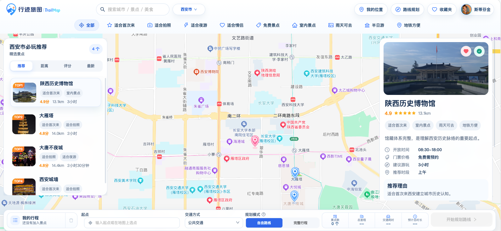
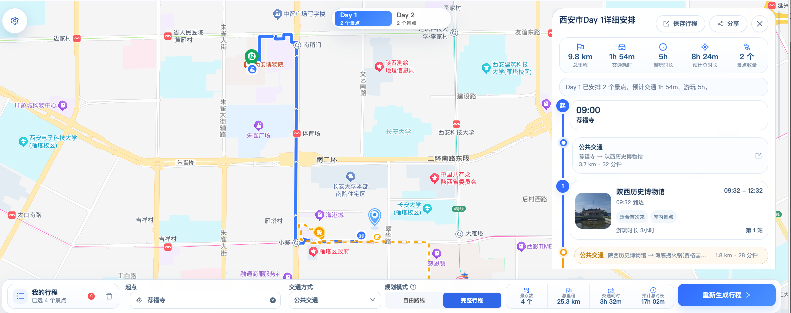
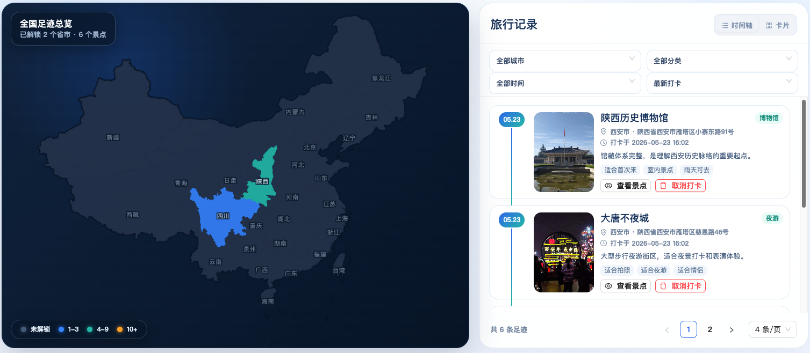
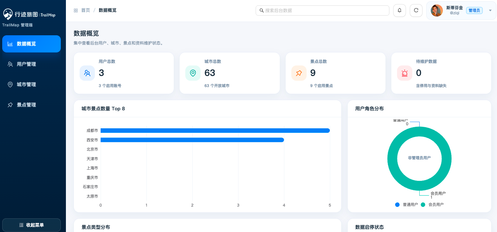

# TrailMap · 行迹旅图

一个面向国内自由行场景的前后端分离旅游地图规划项目。  
项目以地图工作台为核心，支持城市景点浏览、路线规划、完整行程编排、收藏打卡、足迹可视化、行程保存与公开分享。

## 项目亮点

- 地图工作台不是简单的“地图 + 列表”，而是城市、景点、详情、行程池、路线结果、多天时间轴之间的联动页面
- 主地图基于百度地图 JavaScript API，承接景点点位、区域轮廓、路线折线、地图选点和起点定位
- 足迹专题页引入 AntV L7，展示省级和城市级聚合分布，补充专题地理可视化能力
- 后端接入百度地图服务端能力做路线规划与 POI 检索，并在失败时回退本地估算，保证主流程可用
- 支持完整行程模式，将自由路线结果扩展为多天 `Day 1 / Day 2` 时间表，并可插入午餐、休息、酒店等节点

## 功能预览

### 1. 地图工作台

- 城市切换、景点筛选、地图点位、详情面板、行程池联动
- 支持起点选择、当前位置、景点加入行程池和路线规划入口



### 2. 路线规划

- 自由路线模式：按景点池生成路线分段、交通耗时、距离和建议停留时间
- 完整行程模式：支持多天拆分、每日时间表、午餐/休息/酒店节点编排




### 3. 行程池与拖拽调整

- 支持景点加入、移除、清空和前端顺序调整


### 4. 个人足迹与专题可视化

- 支持收藏、打卡、个人主页概览、我的行程和公开分享
- 个人主页聚合展示核心统计，足迹页基于 L7 展示省市聚合结果




### 5. 后台管理与可视化

- 管理后台包含数据概览、用户管理、城市管理和景点管理
- 概览页结合 ECharts 展示用户、城市和景点维度统计



## 核心能力

### 地图与可视化

- 百度地图 JS API：城市定位、Marker、Polyline、区域轮廓、地图选点
- 坐标适配：处理 GCJ-02 / BD-09 转换，保证景点、路线和交互位置一致
- AntV L7：足迹页省市聚合地图
- ECharts：管理后台数据概览图表

### 路线与行程

- 自由路线模式
- 完整行程模式
- 路线结果回放
- 行程保存与公开分享
- 酒店 / 午餐 / 休息节点编排

### 用户能力

- 注册 / 登录
- 收藏 / 取消收藏
- 打卡 / 足迹聚合
- 个人主页统计
- 我的行程管理
- 管理后台：数据概览、用户管理、城市管理、景点管理

## 技术栈

### Frontend

- React 19
- TypeScript 5.8
- Vite 7
- React Router 7
- Ant Design 5
- TanStack Query 5
- Zustand 5
- 百度地图 JavaScript API
- AntV L7
- ECharts

> 当前项目以 TanStack Query + 页面局部状态为主，Zustand 已安装并适合后续承接工作台会话级状态。

### Backend

- Java 21
- Spring Boot 3.3.5
- Spring Security
- MyBatis-Plus 3.5.9
- MySQL
- Flyway
- SpringDoc OpenAPI

## 项目结构

```text
TrailMap
├── backend/      Spring Boot 后端工程
├── docs/         项目文档、Wiki、简历与开发说明
├── frontend/     React 前端工程
├── require/      原始需求、数据库草案与原型图
└── asset/        README 展示图片
```

## 快速启动

### 1. 启动后端

先准备 MySQL 数据库 `trailmap`，再配置本地环境变量或 `backend/.env.local`：

```env
TRAILMAP_DB_HOST=localhost
TRAILMAP_DB_PORT=3306
TRAILMAP_DB_NAME=trailmap
TRAILMAP_DB_USERNAME=root
TRAILMAP_DB_PASSWORD=your_password
TRAILMAP_AUTH_TOKEN_SECRET=your_secret
BAIDU_MAP_SERVER_AK=your_baidu_server_ak
```

运行：

```bash
cd backend
mvn spring-boot:run
```

启动成功后可访问：

- Health: `http://localhost:8080/api/health`
- Swagger UI: `http://localhost:8080/swagger-ui.html`

### 2. 启动前端

在 `frontend/.env.local` 中配置浏览器端 AK：

```env
VITE_BAIDU_MAP_AK=your_baidu_browser_ak
```

运行：

```bash
cd frontend
npm install
npm run dev
```

默认访问：

- Frontend: `http://localhost:5173`

## 文档入口

- Wiki 总览：[docs/wiki/README.md](./docs/wiki/README.md)
- 项目概述：[docs/wiki/01-项目概述.md](./docs/wiki/01-项目概述.md)
- 前端架构：[docs/wiki/03-前端架构.md](./docs/wiki/03-前端架构.md)
- 后端架构：[docs/wiki/04-后端架构.md](./docs/wiki/04-后端架构.md)
- API 文档说明：[docs/wiki/06-API接口文档.md](./docs/wiki/06-API接口文档.md)
