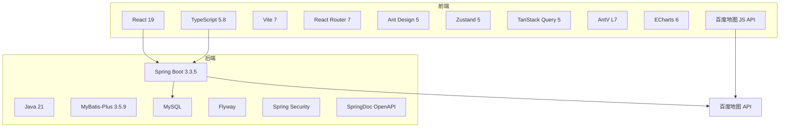
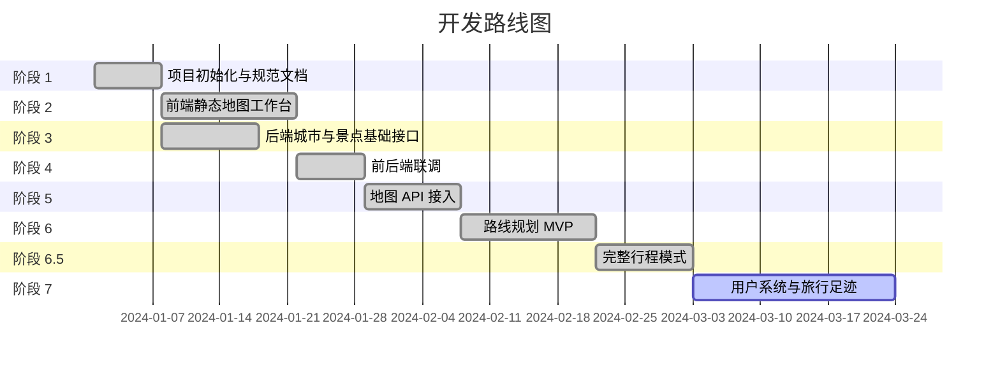

# 01 - 项目概述

## 简介

**行迹旅图**是一个全国旅游地图规划 Web 应用，帮助用户发现城市景点、规划旅行路线并管理个人旅行足迹。

核心价值：
- 提供全国热门旅游城市的景点地图浏览
- 支持基于真实交通的路线规划（类似高德地图）
- 用户可收藏、打卡、保存和分享行程

## 核心功能

### 已完成功能

| 功能模块 | 说明 | 状态 |
|----------|------|------|
| 城市浏览 | 全国城市列表、城市详情、地图定位 | ✅ |
| 景点发现 | 景点列表、标签筛选、关键词搜索、推荐排序 | ✅ |
| 地图展示 | 百度地图集成、景点 Marker、区域轮廓、城市定位 | ✅ |
| 自由路线规划 | 多景点串联、交通方式选择、路线分段展示 | ✅ |
| 完整行程模式 | 多天拆分、时间编排、午餐/休息/酒店节点插入 | ✅ |
| 用户认证 | 注册、登录、JWT Token 鉴权 | ✅ |
| 收藏系统 | 收藏/取消收藏景点、收藏列表管理 | ✅ |
| 打卡系统 | 打卡/取消打卡、足迹列表 | ✅ |
| 足迹地图 | 省级/城市级足迹统计、地图可视化 | ✅ |
| 行程管理 | 保存行程、行程列表、行程详情、行程回放 | ✅ |
| 行程分享 | 公开分享链接、无需登录查看 | ✅ |
| 后台管理 | 城市/景点 CRUD、数据概览 | ✅ |

### 后续规划

| 功能 | 说明 |
|------|------|
| 区域玩法 | 按区域聚合景点，展示区域攻略 |
| 智能排序 | 基于距离和热度的景点智能排序 |
| 打车出行 | 集成打车路线规划 |
| AI 攻略增强 | 餐厅推荐、酒店推荐、雨天替代方案 |

## 技术栈概览



### 前端技术栈

| 技术 | 版本 | 用途 |
|------|------|------|
| React | 19.x | UI 框架 |
| TypeScript | 5.8.x | 类型安全 |
| Vite | 7.x | 构建工具 |
| React Router | 7.x | 路由管理 |
| Ant Design | 5.x | UI 组件库 |
| CSS Modules | - | 样式隔离 |
| Zustand | 5.x | 轻量状态管理 |
| TanStack Query | 5.x | 服务端状态管理 |
| AntV L7 | 2.22.x | 地理数据可视化 |
| ECharts | 6.x | 图表可视化 |
| 百度地图 JS API | - | 地图展示与路线 |

### 后端技术栈

| 技术 | 版本 | 用途 |
|------|------|------|
| Java | 21 | 编程语言 |
| Spring Boot | 3.3.5 | 应用框架 |
| Maven | - | 依赖管理与构建 |
| MyBatis-Plus | 3.5.9 | ORM 框架 |
| MySQL | - | 关系型数据库 |
| Flyway | - | 数据库版本迁移 |
| Spring Security | - | 认证授权 |
| SpringDoc OpenAPI | 2.6.0 | API 文档（Swagger） |

## 开发路线图



| 阶段 | 名称 | 状态 | 关键交付物 |
|------|------|------|-----------|
| 1 | 项目初始化与规范文档 | ✅ 完成 | 前后端骨架、AGENT.MD、开发规划 |
| 2 | 前端静态地图工作台 | ✅ 完成 | 顶部导航、分类筛选、地图区域、景点列表 |
| 3 | 后端城市与景点基础接口 | ✅ 完成 | City/Spot/Tag 表、REST 接口、Flyway |
| 4 | 前后端联调 | ✅ 完成 | TanStack Query、接口类型、Vite 代理 |
| 5 | 地图 API 接入 | ✅ 完成 | 百度地图、Marker、POI 校准 |
| 6 | 路线规划 MVP | ✅ 完成 | 景点池、自由路线、路线分段 |
| 6.5 | 完整行程模式 | ✅ 完成 | 多天拆分、时间编排、补充节点 |
| 7 | 用户系统与旅行足迹 | 🔄 进行中 | 登录注册、收藏打卡、足迹地图、行程管理 |

## 仓库结构

```
trail-map/
├── backend/                 # Java Spring Boot 后端
│   ├── src/main/java/com/trailmap/
│   │   ├── common/          # 统一返回体、错误码、全局异常
│   │   ├── config/          # Spring 配置（安全、数据库、OpenAPI）
│   │   ├── controller/      # REST 控制器（16 个）
│   │   ├── entity/          # 数据库实体（11 个）
│   │   ├── enums/           # 枚举类
│   │   ├── exception/       # 业务异常
│   │   ├── mapper/          # MyBatis-Plus Mapper（12 个）
│   │   ├── model/           # 请求/响应 DTO（55 个）
│   │   ├── security/        # 认证授权相关
│   │   ├── service/         # 业务服务（16 个接口 + 16 个实现）
│   │   └── TrailMapApplication.java
│   └── src/main/resources/
│       ├── db/migration/    # Flyway 迁移脚本（13 个）
│       ├── application.yml  # 主配置
│       └── application-local.yml  # 本地开发配置（.gitignore）
├── frontend/                # React + TypeScript 前端
│   └── src/
│       ├── admin/           # 后台管理页面
│       ├── api/             # 业务接口请求（3 个模块）
│       ├── components/      # 组件（map-workbench 为核心）
│       ├── config/          # 前端配置
│       ├── hooks/           # 自定义 Hooks（3 个）
│       ├── lib/             # 通用封装（http、authToken、baiduMap、queryClient）
│       ├── pages/           # 路由级页面（7 个模块）
│       ├── styles/          # 全局样式
│       ├── types/           # TypeScript 类型定义
│       └── utils/           # 工具函数
├── docs/                    # 项目文档
├── require/                 # 需求文档与原型图
└── wiki/                    # 本 Wiki
```
