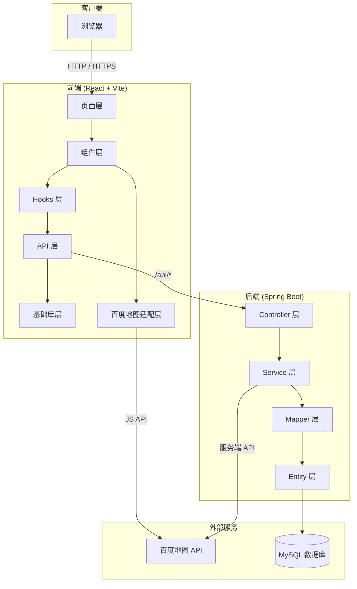
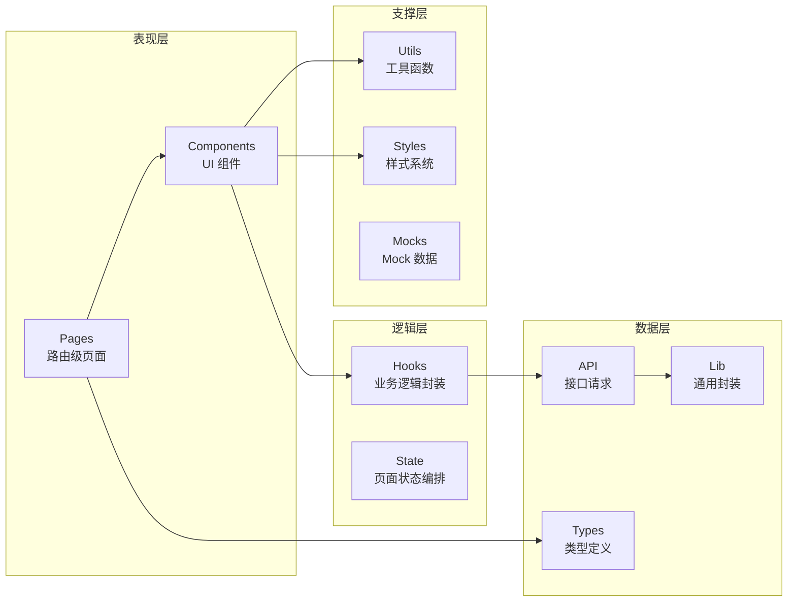
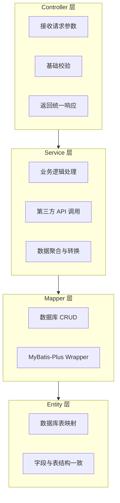
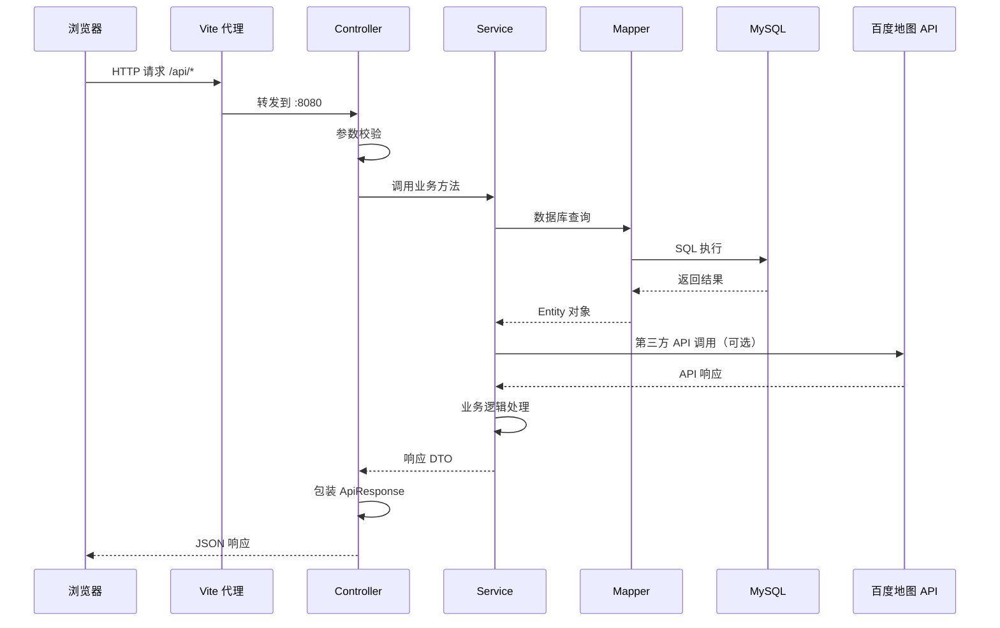
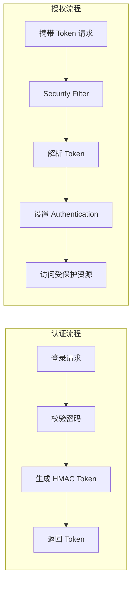

# 02 - 架构总览

## 系统架构

本项目采用**前后端分离**架构，前端为 SPA 应用，后端提供 RESTful API，通过 HTTP 通信。

## 前端分层架构

| 层级 | 目录 | 职责 |
|------|------|------|
| 页面层 | `src/pages/` | 路由级页面入口，组织布局和跨组件状态 |
| 组件层 | `src/components/` | UI 组件，按业务域分组（map-workbench、admin 等） |
| 逻辑层 | `src/hooks/` | 自定义 Hooks，封装业务查询和状态逻辑 |
| 数据层 | `src/api/` | 业务接口请求，与后端 API 对应 |
| 基础库 | `src/lib/` | HTTP 封装、Token 管理、地图加载、Query Client |
| 类型 | `src/types/` | TypeScript 接口和类型定义 |
| 工具 | `src/utils/` | 纯函数工具（坐标转换、路线配色、行程构建等） |
| 样式 | `src/styles/` | 全局样式和 CSS 变量 |

## 后端分层架构

| 层级 | 包路径 | 职责 | 规范 |
|------|--------|------|------|
| Controller | `com.trailmap.controller` | 参数接收、基础校验、返回结果 | 不写复杂业务逻辑 |
| Service | `com.trailmap.service` | 业务逻辑处理 | 接口 + 实现分离 |
| Mapper | `com.trailmap.mapper` | 数据库访问 | 只做 CRUD，不写业务判断 |
| Entity | `com.trailmap.entity` | 数据库表映射 | 字段与数据库设计保持一致 |
| Model | `com.trailmap.model` | 请求/响应 DTO | query/ 请求、response/ 响应 |
| Common | `com.trailmap.common` | 通用组件 | ApiResponse、ErrorCode、GlobalExceptionHandler |
| Config | `com.trailmap.config` | Spring 配置 | 安全、数据库、OpenAPI |
| Security | `com.trailmap.security` | 认证授权 | Token 生成验证、用户鉴权 |

## 请求处理流程

## 认证授权架构

| 组件 | 说明 |
|------|------|
| `AuthController` | 处理登录、注册、当前用户查询 |
| `AuthService` | 密码校验、用户信息查询 |
| `AuthTokenService` | HMAC Token 生成与验证 |
| `SecurityConfig` | Spring Security 配置，URL 权限规则 |
| `PasswordHashService` | 密码哈希处理 |

**权限规则**：
- `/api/auth/**`：公开，无需认证
- `/api/cities/**`、`/api/spots/**`、`/api/tags/**`：公开读取
- `/api/favorite-spots/**`、`/api/checkin-spots/**`、`/api/user-trips/**`：需要登录
- `/api/users/**`：仅 admin 角色

## 外部依赖

| 依赖 | 类型 | 用途 | 配置方式 |
|------|------|------|----------|
| MySQL | 数据库 | 存储所有业务数据 | 环境变量 `TRAILMAP_DB_*` |
| 百度地图 JS API | 前端 SDK | 地图展示、Marker、路线绘制 | `.env.local` 中 `VITE_BAIDU_MAP_AK` |
| 百度地图服务端 API | HTTP API | 路线规划、地点检索、逆地理编码 | 环境变量 `BAIDU_MAP_SERVER_AK` |

## 关键设计决策

| 决策 | 选择 | 原因 |
|------|------|------|
| 前端框架 | React + TypeScript | 类型安全、生态成熟、团队熟悉 |
| 状态管理 | React State + TanStack Query | 页面交互状态以内聚在页面/组件内为主，服务端状态交给 TanStack Query |
| 地图方案 | 百度地图 | 国内地图服务，API 完善，坐标系统一 |
| ORM | MyBatis-Plus | 简化 CRUD，保留 SQL 灵活性 |
| 数据库迁移 | Flyway | 版本化管理，可追溯，不可变历史 |
| 认证方案 | HMAC Bearer Token | 轻量级，MVP 阶段足够，后续可升级 JWT |
| 样式方案 | CSS Modules | 组件级样式隔离，避免全局冲突 |
