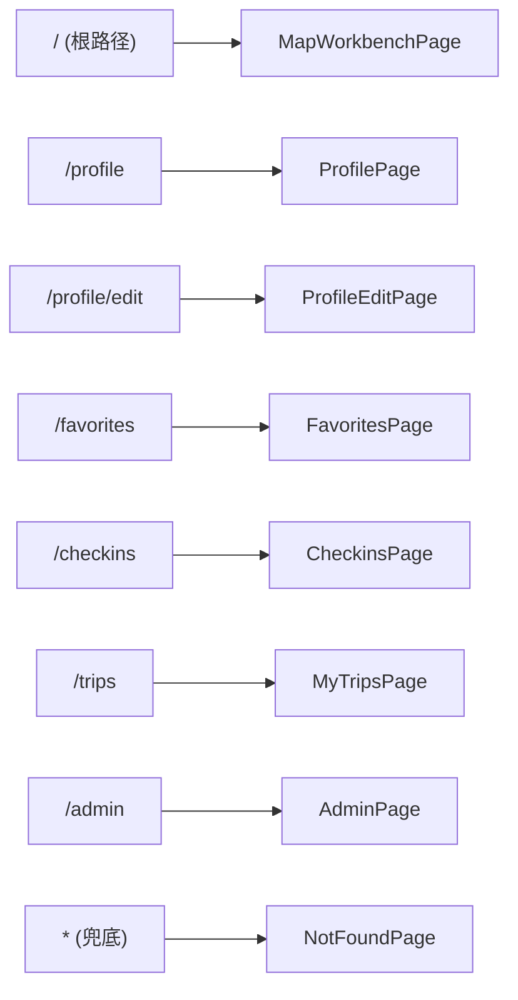
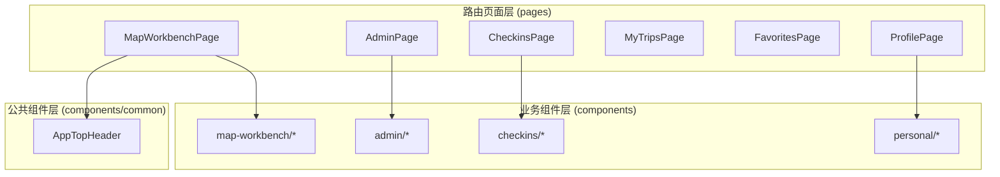
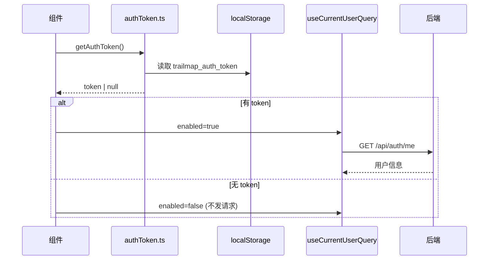
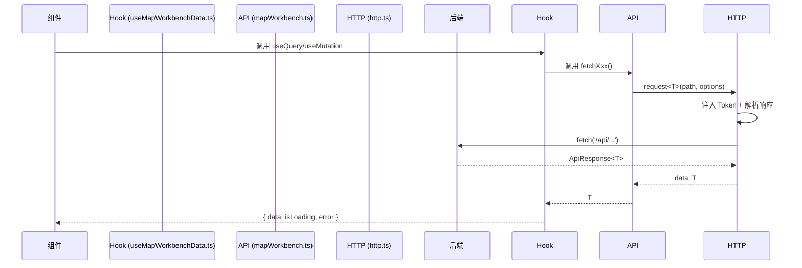

# 03 - 前端架构详解

## 目录

- [技术栈](#技术栈)
- [目录结构](#目录结构)
- [路由系统](#路由系统)
- [组件体系](#组件体系)
- [状态管理](#状态管理)
- [API 客户端](#api-客户端)
- [样式系统](#样式系统)
- [工具函数与辅助模块](#工具函数与辅助模块)
- [环境变量](#环境变量)

---

## 技术栈

| 类别 | 技术 | 版本 | 用途 |
| --- | --- | --- | --- |
| 框架 | React | 19 | UI 库 |
| 语言 | TypeScript | 5.8 | 类型安全 |
| 构建工具 | Vite | 7 | 开发服务器与生产构建 |
| 路由 | React Router | 7 | 客户端路由 |
| UI 组件库 | Ant Design | 5 | 通用 UI 组件 |
| 数据请求 | TanStack Query | 5 | 服务端数据缓存与同步 |
| 地图可视化 | AntV L7 | 2.22 | 地理空间数据渲染（足迹地图） |
| 图表 | ECharts | 6 | 数据图表（管理后台） |
| 地图 | 百度地图 JS API | - | 核心地图展示与路线绘制 |
| 样式 | CSS Modules | - | 组件级样式隔离 |

---

## 目录结构

```
frontend/src/
├── api/                  # 业务接口请求模块
│   ├── admin.ts          # 管理后台接口
│   ├── auth.ts           # 认证接口（登录/注册/用户信息）
│   └── mapWorkbench.ts   # 地图工作台核心接口
├── assets/               # 静态资源
├── components/           # 组件目录
│   ├── admin/            # 管理后台布局组件
│   ├── checkins/         # 打卡足迹组件
│   ├── common/           # 全局公共组件
│   ├── map-workbench/    # 地图工作台核心组件（10 个子目录）
│   └── personal/         # 个人中心布局组件
├── hooks/                # 自定义 Hooks
│   ├── useAdminData.ts   # 管理后台数据查询 Hook 集合
│   ├── useDebouncedValue.ts
│   └── useMapWorkbenchData.ts  # 工作台数据查询 Hook 集合
├── lib/                  # 基础设施层
│   ├── authToken.ts      # Token 存取
│   ├── baiduMap.ts       # 百度地图 SDK 加载
│   ├── http.ts           # 统一 HTTP 请求封装
│   └── queryClient.ts    # TanStack Query 客户端配置
├── pages/                # 路由级页面
│   ├── admin/            # 管理后台
│   ├── checkins/         # 我的足迹
│   ├── favorites/        # 我的收藏
│   ├── map-workbench/    # 地图工作台（核心页面）
│   ├── not-found/        # 404 页面
│   ├── profile/          # 个人主页 + 编辑
│   └── trips/            # 我的行程
├── styles/               # 全局样式
│   └── global.css
├── types/                # TypeScript 类型定义
│   ├── admin.ts          # 管理后台类型
│   ├── auth.ts           # 认证类型
│   ├── baidu-map.d.ts    # 百度地图类型声明
│   └── mapWorkbench.ts   # 工作台核心类型
├── utils/                # 工具函数
│   ├── admin/            # 管理后台工具
│   └── map-workbench/    # 地图工作台工具（7 个文件）
└── App.tsx               # 应用根组件（路由注册）
```

---

## 路由系统

前端使用 **React Router 7** 进行客户端路由管理，路由定义集中在 `App.tsx`：



### 路由表

| 路径 | 页面组件 | 懒加载 | 登录要求 | 说明 |
| --- | --- | --- | --- | --- |
| `/` | `MapWorkbenchPage` | 否 | 否 | 核心地图工作台，同步加载 |
| `/profile` | `ProfilePage` | 否 | 是 | 个人主页 |
| `/profile/edit` | `ProfileEditPage` | 否 | 是 | 个人资料编辑 |
| `/favorites` | `FavoritesPage` | 否 | 是 | 景点收藏列表 |
| `/checkins` | `CheckinsPage` | **是** | 是 | 打卡足迹（含 L7 足迹地图） |
| `/trips` | `MyTripsPage` | 否 | 是 | 已保存行程管理 |
| `/admin` | `AdminPage` | **是** | ADMIN 角色 | 管理后台 |
| `*` | `NotFoundPage` | 否 | 否 | 404 兜底 |

> **懒加载策略**：`CheckinsPage` 和 `AdminPage` 使用 `React.lazy` + `Suspense` 进行代码分割，前者因为加载 AntV L7 地图库体积较大，后者为管理端功能独立分割。

---

## 组件体系

### 组件分层



### 地图工作台核心组件

`src/components/map-workbench/` 是整个前端最核心的组件目录，包含 10 个子组件：

| 组件 | 文件 | 职责 |
| --- | --- | --- |
| `WorkbenchHeader` | `.tsx` + `.module.css` | 顶部导航栏：城市选择、景点筛选标签、搜索框、登录入口 |
| `BaiduMapStage` | `.tsx` + `.module.css` + `.ts` | 百度地图主舞台：地图实例管理、景点标注、路线绘制、交互联动 |
| `SpotRecommendList` | `.tsx` + `.module.css` + `.ts` | 景点推荐列表：按标签/关键词筛选、列表渲染、拖拽入行程池 |
| `SpotDetailPanel` | `.tsx` + `.module.css` + `.ts` | 景点详情面板：图片轮播、标签、描述、收藏/打卡操作 |
| `TripPlannerDock` | `.tsx` + `.module.css` + `.ts` | 行程池拖拽停靠区：已选景点管理、顺序调整、路线规划触发 |
| `RoutePlanDrawer` | `.tsx` + `.module.css` | 路线规划结果抽屉：路线时间轴、多日行程视图、行程回放 |
| `SchedulePlanFormFields` | `.tsx` | 日程规划表单：出行天数、起点、每日时间配置 |
| `ScheduleResultSettingsDrawer` | `.tsx` | 日程结果设置抽屉：结果微调与配置 |
| `RouteShareDialog` | `.tsx` | 路线分享对话框：生成分享链接 |
| `AuthDialog` | `.tsx` | 登录/注册对话框 |

### 其他业务组件

| 组件 | 位置 | 职责 |
| --- | --- | --- |
| `AdminSidebar` | `components/admin/` | 管理后台侧边栏 |
| `AdminTopBar` | `components/admin/` | 管理后台顶部栏 |
| `CheckinL7FootprintMap` | `components/checkins/` | AntV L7 足迹地图（省级/市级热力分布） |
| `PersonalPageLayout` | `components/personal/` | 个人中心通用布局壳 |
| `AppTopHeader` | `components/common/` | 全局顶部导航（非工作台页面共用） |

### MapWorkbenchPage 核心页面

`MapWorkbenchPage.tsx`（约 2261 行）是整个前端最复杂的页面组件，承担以下职责：

1. **城市与景点选择管理**：接收 URL 参数 `cityId`，管理城市切换
2. **景点筛选与搜索**：协调标签筛选、关键词搜索与列表联动
3. **行程池管理**：管理已选景点列表、拖拽排序
4. **路线规划协调**：触发自由模式/日程模式路线规划
5. **用户认证状态**：协调登录态检测、Token 存取
6. **收藏/打卡操作**：管理景点的收藏和打卡交互

---

## 状态管理

前端采用 **TanStack Query + 页面局部状态** 的状态策略：

### TanStack Query（服务端状态）

TanStack Query 负责所有后端数据的请求、缓存与同步；页面交互状态主要使用页面级 `useState` 和少量组件内部状态维护，统一配置入口在 `lib/queryClient.ts`：

```typescript
// 默认配置
const queryClient = new QueryClient({
  defaultOptions: {
    queries: {
      retry: 1,                    // 失败重试 1 次
      staleTime: 60_000,           // 数据 60 秒内视为新鲜
      refetchOnWindowFocus: false, // 切换窗口不自动刷新
    },
  },
});
```

所有 Query 和 Mutation Hook 集中在 `hooks/` 目录：

| Hook 文件 | 包含的 Hooks | 功能域 |
| --- | --- | --- |
| `useMapWorkbenchData.ts` | `useCitiesQuery`, `useCitySpotsQuery`, `useRoutePlanMutation`, `useFavoriteSpotMutation`, `useCheckinSpotMutation`, `useSaveUserTripMutation`, `useCurrentUserQuery`, `useLoginMutation` 等约 30 个 | 地图工作台全功能 |
| `useAdminData.ts` | `useAdminOverviewQuery`, `useAdminUsersQuery`, `useAdminCitiesQuery`, `useAdminSpotsQuery` 等约 12 个 | 管理后台 |

### 认证状态（localStorage + Query）

认证采用 localStorage 存储 Token + TanStack Query 查询用户信息的模式：



Token 管理工具 `lib/authToken.ts`：

| 方法 | 功能 |
| --- | --- |
| `getAuthToken()` | 从 localStorage 读取 token |
| `setAuthToken(token)` | 写入 token 到 localStorage |
| `clearAuthToken()` | 清除 localStorage 中的 token |

---

## API 客户端

### HTTP 请求封装

`lib/http.ts` 提供统一的请求函数 `request<T>()`，核心特性：

1. **自动注入 Token**：从 `authToken.ts` 读取并附加 `Authorization: Bearer <token>` 头
2. **统一解析 ApiResponse**：自动提取后端 `{ success, code, message, data }` 结构的 `data` 字段
3. **错误处理**：根据 HTTP 状态码和 `success` 字段判断请求是否成功
4. **环境变量配置**：通过 `VITE_API_BASE_URL` 支持不同环境的 API 地址

```typescript
// 核心请求函数签名
export async function request<T>(path: string, init?: RequestInit): Promise<T>
```

### 业务 API 模块

所有业务接口按功能域拆分到 `api/` 目录：

| API 文件 | 主要函数 | 功能域 |
| --- | --- | --- |
| `mapWorkbench.ts` | `fetchCities`, `fetchCitySpots`, `fetchRoutePlan`, `saveUserTrip`, `favoriteSpot`, `checkinSpot` 等 | 地图工作台全部接口 |
| `auth.ts` | `loginUser`, `registerUser`, `fetchCurrentUser`, `updateCurrentUserProfile` | 认证相关 |
| `admin.ts` | `fetchAdminOverview`, `fetchAdminUsers`, `fetchAdminCities`, `fetchAdminSpots` 及增删改接口 | 管理后台 |

### API 调用链路



---

## 样式系统

### 样式方案

前端采用 **CSS Modules + Ant Design 主题定制** 的混合样式策略：

| 场景 | 方案 | 示例 |
| --- | --- | --- |
| 业务组件样式 | CSS Modules (`.module.css`) | 所有地图工作台组件 |
| 通用 UI 组件 | Ant Design | Button, Tag, Empty, Modal, Input |
| 全局重置样式 | 全局 CSS | `styles/global.css` |
| 主题定制 | ConfigProvider token | 主色 `#2266e8`, 圆角 `8px` |

### CSS Modules 规范

- 每个业务组件配套一个同名 `.module.css` 文件
- 使用 `camelCase` 类名，避免 CSS 选择器冲突
- 优先处理 H5 小屏兼容性，设置 `min-width`/`max-width`

### Ant Design 主题配置

在 `App.tsx` 中通过 `ConfigProvider` 配置全局主题：

| 配置项 | 值 | 说明 |
| --- | --- | --- |
| `colorPrimary` | `#2266e8` | 主色调（蓝色） |
| `borderRadius` | `8` | 全局圆角 |
| `fontFamily` | `PingFang SC, Microsoft YaHei, system-ui` | 字体栈 |
| `Button.controlHeight` | `34` | 按钮高度 |
| `Segmented.itemSelectedBg` | `#2266e8` | 分段选择器选中背景 |
| 语言 | `zhCN` | 中文本地化 |

### 全局样式

`styles/global.css` 提供基础重置：

```css
* { box-sizing: border-box; }
body {
  margin: 0;
  min-width: 320px;
  color: #15213b;
  background: #eef4ff;
}
button, input, textarea, select { font: inherit; }
```

---

## 工具函数与辅助模块

### 地图工作台工具 (`utils/map-workbench/`)

| 文件 | 职责 |
| --- | --- |
| `coordinate.ts` | 坐标系转换（GCJ-02 ↔ BD09） |
| `routeDisplay.ts` | 路线展示数据格式化 |
| `routePalette.ts` | 路线颜色调色板 |
| `schedulePlanTime.ts` | 日程规划时间计算 |
| `spotDisplay.ts` | 景点展示数据格式化 |
| `spotFilters.ts` | 景点筛选逻辑 |
| `tripPayload.ts` | 行程保存数据构建 |

### 管理后台工具 (`utils/admin/`)

| 文件 | 职责 |
| --- | --- |
| `format.ts` | 管理后台数据格式化 |

### 基础设施模块 (`lib/`)

| 文件 | 职责 |
| --- | --- |
| `http.ts` | 统一 HTTP 请求封装（Token 注入、ApiResponse 解析） |
| `authToken.ts` | 认证 Token 存取（localStorage） |
| `queryClient.ts` | TanStack Query 客户端实例与默认配置 |
| `baiduMap.ts` | 百度地图 JS API SDK 动态加载 |

---

## 环境变量

前端通过 Vite 的 `.env` 文件管理环境变量，所有变量以 `VITE_` 开头：

| 变量 | 用途 | 默认值 |
| --- | --- | --- |
| `VITE_API_BASE_URL` | 后端 API 基础地址 | `""`（开发时由 Vite 代理） |
| `VITE_BAIDU_MAP_AK` | 百度地图 JS API AK | - |

> **安全约束**：禁止将 AK 或敏感 Key 硬编码到源码，必须通过 `.env.local` 注入。
