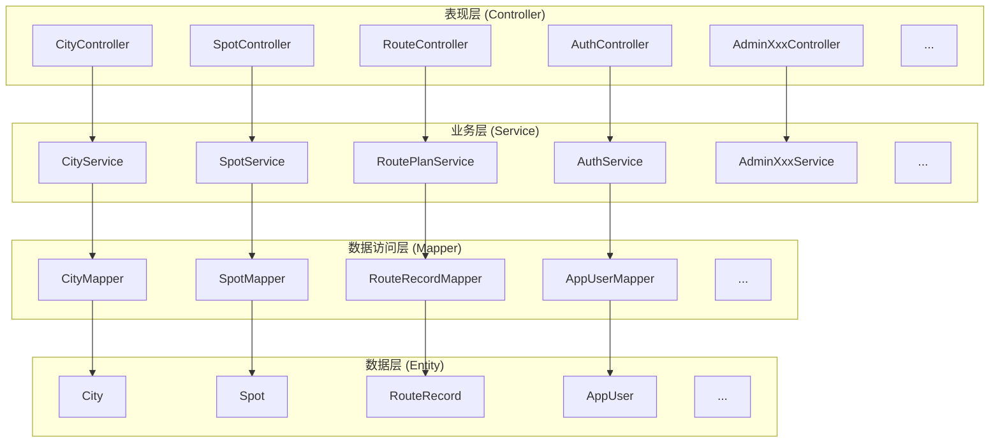
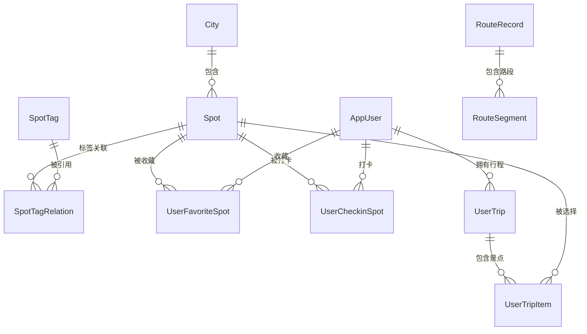
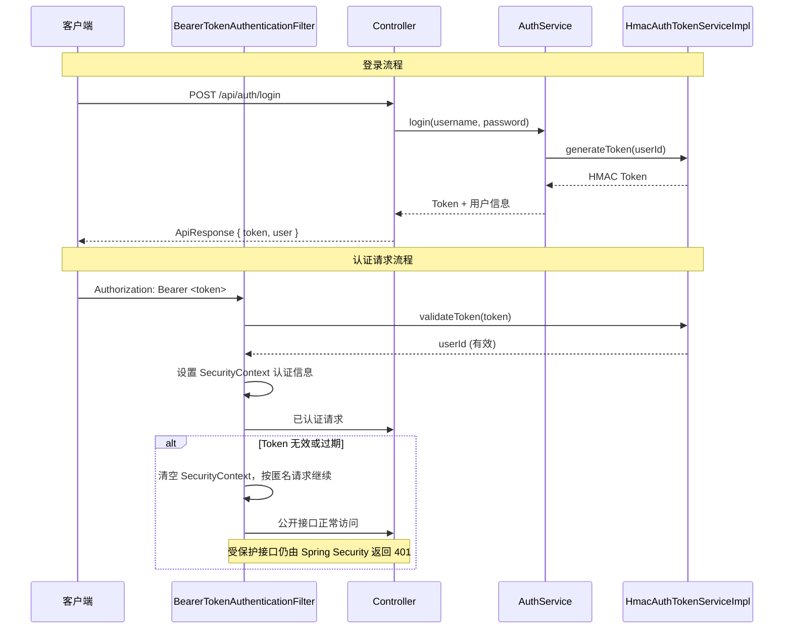
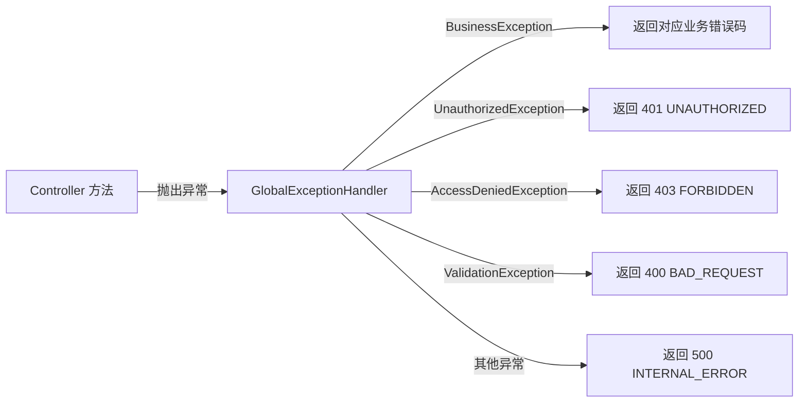

# 04 - 后端架构详解

## 目录

- [技术栈](#技术栈)
- [包结构](#包结构)
- [分层架构](#分层架构)
- [控制器层 (Controller)](#控制器层-controller)
- [服务层 (Service)](#服务层-service)
- [数据访问层 (Mapper)](#数据访问层-mapper)
- [领域模型 (Entity)](#领域模型-entity)
- [请求/响应模型 (Model)](#请求响应模型-model)
- [公共模块 (Common)](#公共模块-common)
- [配置模块 (Config)](#配置模块-config)
- [安全与认证 (Security)](#安全与认证-security)
- [异常处理](#异常处理)
- [枚举定义](#枚举定义)

---

## 技术栈

| 类别 | 技术 | 版本 | 用途 |
| --- | --- | --- | --- |
| 语言 | Java | 21 | 主语言 |
| 框架 | Spring Boot | 3.3.5 | Web 应用框架 |
| 构建工具 | Maven | - | 依赖管理与构建 |
| ORM | MyBatis-Plus | 3.5.9 | 数据库访问增强 |
| 数据库 | MySQL | 8.x | 关系型数据库 |
| 数据库迁移 | Flyway | - | 版本化数据库变更 |
| 安全框架 | Spring Security | - | 认证与授权 |
| API 文档 | SpringDoc OpenAPI | 2.6.0 | Swagger UI 自动生成 |

---

## 包结构

```
com.trailmap
├── common/           # 公共模块：统一响应、错误码、全局异常处理
├── config/           # Spring 配置：Security、MyBatis-Plus、OpenAPI、百度地图
├── controller/       # 控制器层：16 个 REST Controller
├── entity/           # 领域实体：11 个 JPA/MyBatis-Plus 实体类
├── enums/            # 枚举定义：SpotType, UserType
├── exception/        # 自定义异常：BusinessException, UnauthorizedException
├── mapper/           # Mapper 层：12 个 MyBatis-Plus Mapper 接口
├── model/            # 请求/响应 DTO
│   ├── query/        # 查询参数 DTO（19 个）
│   └── response/     # 响应 DTO（36 个）
├── security/         # 安全模块：Token 认证过滤器、安全异常处理
├── service/          # 服务层：16 个 Service 接口
│   └── impl/         # 服务实现：16 个 Service 实现类
└── TrailMapApplication.java  # 启动类
```

---

## 分层架构

后端采用经典的 **Controller → Service → Mapper** 三层架构：



### 分层职责

| 层级 | 职责 | 约束 |
| --- | --- | --- |
| **Controller** | 接收 HTTP 请求、参数校验、调用 Service、返回 ApiResponse | 不写复杂业务逻辑 |
| **Service** | 业务逻辑编排、外部 API 调用、数据转换 | 接口与实现分离 |
| **Mapper** | 数据库 CRUD 操作、SQL 映射 | 继承 MyBatis-Plus BaseMapper |
| **Entity** | 数据库表映射实体 | 字段与表结构一一对应 |

---

## 控制器层 (Controller)

共 16 个 REST Controller，按功能域组织：

### 公开接口（无需认证）

| Controller | 路径前缀 | 职责 |
| --- | --- | --- |
| `CityController` | `/api/cities` | 城市列表、城市详情 |
| `SpotController` | `/api/spots` | 景点详情 |
| `TagController` | `/api/tags` | 标签列表 |
| `RouteController` | `/api/route-plan` | 路线规划 |
| `PoiCalibrationController` | `/api/poi-calibration` | POI 校准候选查询 |
| `PublicTripController` | `/api/public-trips` | 公开分享行程查看 |
| `HealthController` | `/api/health` | 健康检查 |
| `AuthController` | `/api/auth` | 注册、登录 |

### 认证接口（需登录）

| Controller | 路径前缀 | 职责 |
| --- | --- | --- |
| `UserProfileController` | `/api/users/me` | 当前用户信息、个人资料更新 |
| `FavoriteSpotController` | `/api/favorite-spots` | 收藏/取消收藏、收藏列表 |
| `CheckinSpotController` | `/api/checkin-spots` | 打卡/取消打卡、足迹列表、足迹地图 |
| `UserTripController` | `/api/user-trips` | 行程保存、列表、详情、删除、分享 |
| `UserController` | `/api/users` | 用户管理（需 ADMIN 角色） |

### 管理后台接口（需 ADMIN 角色）

| Controller | 路径前缀 | 职责 |
| --- | --- | --- |
| `AdminOverviewController` | `/api/admin/overview` | 管理后台数据概览统计 |
| `AdminCityController` | `/api/admin/cities` | 城市 CRUD 管理 |
| `AdminSpotController` | `/api/admin/spots` | 景点 CRUD 管理 |

### Controller 编码规范

```java
@RestController
@RequestMapping("/api/cities")
@Tag(name = "城市", description = "城市相关接口")
public class CityController {

    private final CityService cityService;

    public CityController(CityService cityService) {
        this.cityService = cityService;
    }

    @GetMapping
    @Operation(summary = "获取城市列表")
    public ApiResponse<List<CitySummaryResponse>> listCities() {
        return ApiResponse.success(cityService.listCities());
    }
}
```

**要点**：
- 使用 `@RestController` + `@RequestMapping` 声明 REST 控制器
- 构造器注入 Service
- 返回统一 `ApiResponse<T>` 包装
- 使用 SpringDoc `@Tag` / `@Operation` 注解生成 API 文档

---

## 服务层 (Service)

共 16 个 Service 接口及对应实现类，遵循**接口与实现分离**原则：

### 核心业务服务

| Service | 实现类 | 核心职责 |
| --- | --- | --- |
| `CityService` | `CityServiceImpl` | 城市列表查询、城市详情 |
| `SpotService` | `SpotServiceImpl` | 景点查询、详情、列表筛选 |
| `TagService` | `TagServiceImpl` | 标签管理 |
| `RoutePlanService` | `RoutePlanServiceImpl` | **核心服务**：自由模式/日程模式路线规划，集成百度地图路线 API |
| `PoiCalibrationService` | `PoiCalibrationServiceImpl` | POI 搜索校准，与百度地图 Places API 交互 |

### 用户域服务

| Service | 实现类 | 核心职责 |
| --- | --- | --- |
| `AuthService` | `AuthServiceImpl` | 用户注册、登录、Token 签发 |
| `AuthTokenService` | `HmacAuthTokenServiceImpl` | HMAC Token 生成与验证 |
| `PasswordHashService` | `Pbkdf2PasswordHashServiceImpl` | PBKDF2 密码哈希 |
| `AppUserService` | `AppUserServiceImpl` | 用户实体 CRUD |
| `UserProfileService` | `UserProfileServiceImpl` | 用户资料管理、概览统计 |
| `FavoriteSpotService` | `FavoriteSpotServiceImpl` | 景点收藏/取消收藏 |
| `CheckinSpotService` | `CheckinSpotServiceImpl` | 景点打卡/取消打卡、足迹统计 |
| `UserTripService` | `UserTripServiceImpl` | 用户行程 CRUD、分享管理 |

### 管理后台服务

| Service | 实现类 | 核心职责 |
| --- | --- | --- |
| `AdminOverviewService` | `AdminOverviewServiceImpl` | 管理后台统计概览 |
| `AdminCityService` | `AdminCityServiceImpl` | 管理端城市增删改查 |
| `AdminSpotService` | `AdminSpotServiceImpl` | 管理端景点增删改查 |
| `AdminMapDataService` | `AdminMapDataServiceImpl` | 百度行政区划、城市中心点和管理端景点候选查询 |

### 核心服务示例：RoutePlanServiceImpl

`RoutePlanServiceImpl` 是后端最复杂的服务（约 972 行），负责：

1. **自由模式路线规划**：将行程池中的景点按顺序进行路线规划
2. **日程模式路线规划**：支持多日行程自动拆分、时间调度
3. **百度地图 API 集成**：调用服务端路线规划 API，降级处理
4. **午餐/休息/住宿节点**：自动插入合理的中途节点
5. **坐标系转换**：GCJ-02 ↔ BD09 坐标互转

---

## 数据访问层 (Mapper)

共 12 个 MyBatis-Plus Mapper 接口：

| Mapper | 对应 Entity | 特殊方法 |
| --- | --- | --- |
| `CityMapper` | `City` | - |
| `SpotMapper` | `Spot` | 按城市、标签、关键词筛选查询 |
| `SpotTagMapper` | `SpotTag` | - |
| `SpotTagRelationMapper` | `SpotTagRelation` | - |
| `AppUserMapper` | `AppUser` | 按用户名查询 |
| `UserProfileMapper` | `AppUser` | 用户概览统计联合查询 |
| `RouteRecordMapper` | `RouteRecord` | - |
| `RouteSegmentMapper` | `RouteSegment` | - |
| `UserFavoriteSpotMapper` | `UserFavoriteSpot` | 收藏状态查询、收藏列表 |
| `UserCheckinSpotMapper` | `UserCheckinSpot` | 打卡状态查询、足迹列表、足迹聚合 |
| `UserTripMapper` | `UserTrip` | 行程列表、行程详情 |
| `UserTripItemMapper` | `UserTripItem` | 行程内景点关联 |

所有 Mapper 继承 `BaseMapper<Entity>`，享受 MyBatis-Plus 提供的通用 CRUD 能力。

---

## 领域模型 (Entity)

共 11 个实体类，映射数据库表：



| Entity | 对应表 | 核心字段 |
| --- | --- | --- |
| `City` | `city` | id, name, province, centerLng, centerLat |
| `Spot` | `spot` | id, cityId, name, type, coverUrl, longitude, latitude |
| `SpotTag` | `spot_tag` | id, name, code |
| `SpotTagRelation` | `spot_tag_relation` | spotId, tagId |
| `AppUser` | `app_user` | id, username, nickname, passwordHash, userType, status |
| `UserFavoriteSpot` | `user_favorite_spot` | userId, spotId |
| `UserCheckinSpot` | `user_checkin_spot` | userId, spotId, remark |
| `UserTrip` | `user_trip` | id, userId, tripName, planMode, shareEnabled, shareToken |
| `UserTripItem` | `user_trip_spot` | tripId, spotId, dayIndex, sortOrder |
| `RouteRecord` | `route_record` | id, tripId, mode |
| `RouteSegment` | `route_segment` | id, routeId, fromSpotId, toSpotId, distance, duration |

---

## 请求/响应模型 (Model)

请求和响应 DTO 分为两类，存放在 `model/` 目录下：

### 查询参数 (`model/query/`, 19 个)

用于 Controller 方法的 `@RequestBody` 或查询参数绑定，例如：
- `CitySpotQueryRequest`：城市景点筛选参数
- `RoutePlanRequest`：路线规划请求体
- `AdminUserQueryRequest`：管理后台用户筛选

### 响应数据 (`model/response/`, 36 个)

用于 Controller 返回的数据结构，例如：
- `CitySummaryResponse`：城市摘要
- `SpotDetailResponse`：景点详情（含标签、图片）
- `RoutePlanResponse`：路线规划结果（含路线段、总距离/时间）
- `UserProfileOverviewResponse`：用户主页概览统计
- `AdminOverviewResponse`：管理后台统计概览

---

## 公共模块 (Common)

### ApiResponse 统一响应

```java
public record ApiResponse<T>(boolean success, String code, String message, T data) {
    public static <T> ApiResponse<T> success(T data) {
        return new ApiResponse<>(true, "SUCCESS", "ok", data);
    }

    public static <T> ApiResponse<T> failure(String code, String message) {
        return new ApiResponse<>(false, code, message, null);
    }
}
```

### ErrorCode 错误码

| 错误码 | HTTP 状态 | 说明 |
| --- | --- | --- |
| `SUCCESS` | 200 | 成功 |
| `BAD_REQUEST` | 400 | 请求参数错误 |
| `UNAUTHORIZED` | 401 | 未认证 |
| `FORBIDDEN` | 403 | 无权限 |
| `NOT_FOUND` | 404 | 资源不存在 |
| `INTERNAL_ERROR` | 500 | 服务器内部错误 |

### GlobalExceptionHandler

全局异常处理器，捕获以下异常并返回统一 `ApiResponse`：

| 异常类型 | 处理方式 |
| --- | --- |
| `BusinessException` | 返回对应业务错误码 |
| `UnauthorizedException` | 返回 `UNAUTHORIZED` (401) |
| `AccessDeniedException` | 返回 `FORBIDDEN` (403) |
| `MethodArgumentNotValidException` | 返回 `BAD_REQUEST` (400) + 校验消息 |
| `Exception` | 返回 `INTERNAL_ERROR` (500) |

---

## 配置模块 (Config)

| 配置类 | 职责 |
| --- | --- |
| `SecurityConfig` | Spring Security 配置：认证过滤器、URL 权限规则、CORS |
| `MybatisPlusConfig` | MyBatis-Plus 分页插件等配置 |
| `OpenApiConfig` | SpringDoc OpenAPI / Swagger UI 配置 |
| `BaiduMapProperties` | 百度地图服务端 AK 配置属性 |

### 配置文件 (application.yml)

```yaml
server:
  port: 8080
  address: 127.0.0.1

spring:
  datasource:
    url: jdbc:mysql://localhost:3306/trailmap?...
    username: ${TRAILMAP_DB_USERNAME:root}
    password: ${TRAILMAP_DB_PASSWORD:...}
  flyway:
    enabled: true

baidu:
  map:
    server-ak: ${BAIDU_MAP_SERVER_AK:}

trailmap:
  auth:
    token-secret: ${TRAILMAP_AUTH_TOKEN_SECRET:trailmap-dev-secret}

springdoc:
  swagger-ui:
    path: /swagger-ui.html
```

---

## 安全与认证 (Security)

### 认证架构



### Token 机制

- **算法**：HMAC（基于共享密钥的签名）
- **存储位置**：客户端 localStorage
- **传输方式**：`Authorization: Bearer <token>` HTTP 头
- **签名密钥**：配置项 `trailmap.auth.token-secret`
- **过期降级**：无效 Token 不阻断公开接口；受保护接口仍返回 401，前端据此退出登录

### URL 权限规则

| URL 模式 | 权限 | 说明 |
| --- | --- | --- |
| `/api/auth/register`, `/api/auth/login` | `permitAll` | 注册、登录 |
| `/api/public-trips/**` | `permitAll` | 公开分享行程 |
| `/api/health` | `permitAll` | 健康检查 |
| `/swagger-ui/**`, `/v3/api-docs/**` | `permitAll` | API 文档 |
| `/api/auth/me` | `authenticated` | 当前用户信息 |
| `/api/favorite-spots/**` | `authenticated` | 收藏操作 |
| `/api/checkin-spots/**` | `authenticated` | 打卡操作 |
| `/api/user-trips/**` | `authenticated` | 行程管理 |
| `/api/admin/**` | `hasRole("ADMIN")` | 管理后台与地图资料维护（仅管理员） |
| `/api/users/**` | `hasRole("ADMIN")` | 用户管理（仅管理员） |
| 其他 `/api/cities/**`, `/api/spots/**` 等 | `permitAll` | 公开数据接口 |

### 密码安全

- **算法**：PBKDF2（`Pbkdf2PasswordHashServiceImpl`）
- **盐值**：随机生成，随哈希一起存储
- **迭代次数**：符合 OWASP 推荐标准

---

## 异常处理

### 自定义异常

| 异常类 | 用途 | 抛出场景 |
| --- | --- | --- |
| `BusinessException` | 业务逻辑错误 | 资源不存在、参数校验失败、状态冲突 |
| `UnauthorizedException` | 认证失败 | Token 无效或过期 |

### 全局异常处理链



---

## 枚举定义

| 枚举类 | 用途 | 值 |
| --- | --- | --- |
| `SpotType` | 景点类型分类 | `SCENIC`（景区）、`RESTAURANT`（餐饮）、`HOTEL`（住宿）等 |
| `UserType` | 用户类型 | `NORMAL`（普通用户）、`ADMIN`（管理员） |
