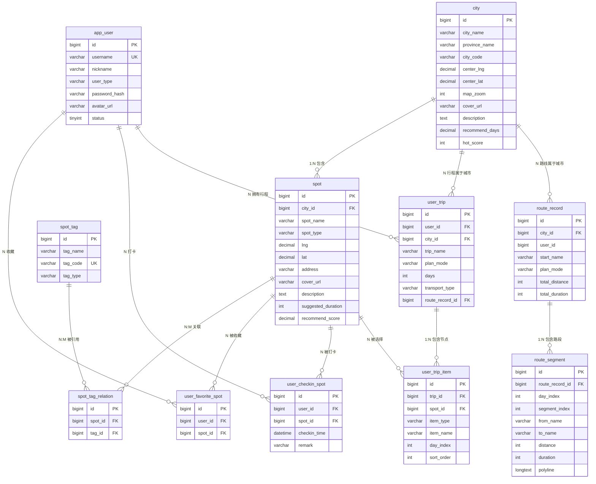

# 05 - 数据模型与数据库

## 目录

- [数据库概览](#数据库概览)
- [实体关系图](#实体关系图)
- [Flyway 迁移管理](#flyway-迁移管理)
- [MVP 核心表](#mvp-核心表)
- [用户系统表](#用户系统表)
- [路线规划表](#路线规划表)
- [索引与约束设计](#索引与约束设计)

---

## 数据库概览

| 属性 | 值 |
| --- | --- |
| 数据库类型 | MySQL 8.x |
| 字符集 | UTF-8 |
| 时区 | Asia/Shanghai |
| 迁移工具 | Flyway |
| ORM 框架 | MyBatis-Plus 3.5.9 |
| 表总数 | 14 张 |

### 表清单

| 分组 | 表名 | 说明 |
| --- | --- | --- |
| MVP 核心 | `city` | 城市信息 |
| MVP 核心 | `spot` | 景点信息（核心表） |
| MVP 核心 | `spot_tag` | 景点标签 |
| MVP 核心 | `spot_tag_relation` | 景点-标签多对多关联 |
| 用户系统 | `app_user` | 用户账号 |
| 用户系统 | `user_favorite_spot` | 用户收藏景点 |
| 用户系统 | `user_checkin_spot` | 用户打卡景点 |
| 用户系统 | `user_trip` | 用户保存行程 |
| 用户系统 | `user_trip_item` | 行程内景点/节点（原 `user_trip_spot`） |
| 路线规划 | `route_record` | 路线规划记录 |
| 路线规划 | `route_segment` | 路线分段明细 |

---

## 实体关系图

---

## Flyway 迁移管理

项目使用 Flyway 进行数据库版本化迁移，迁移脚本位于 `backend/src/main/resources/db/migration/`。

### 迁移版本列表

| 版本 | 文件名 | 说明 |
| --- | --- | --- |
| V1 | `V1__init_core_tables.sql` | 初始化核心表：city, spot, spot_tag, spot_tag_relation |
| V2 | `V2__seed_base_data.sql` | 种子数据：基础城市和标签数据 |
| V3 | `V3__add_spot_boundary.sql` | 新增景点轮廓 GeoJSON 字段 |
| V4 | `V4__calibrate_xian_spots.sql` | 校准西安景点坐标数据 |
| V5 | `V5__refine_xian_spots_by_baidu_place_api.sql` | 通过百度 Place API 优化西安景点 |
| V6 | `V6__calibrate_all_spots_by_baidu_place_api.sql` | 通过百度 Place API 校准全部景点 |
| V7 | `V7__replace_spot_cover_urls_with_real_images.sql` | 替换景点封面图为真实图片 |
| V8 | `V8__create_user_domain_tables.sql` | 创建用户系统表：app_user, user_favorite_spot, user_checkin_spot, user_trip, user_trip_spot |
| V9 | `V9__add_route_persistence_and_refine_trip.sql` | 新增路线持久化表（route_record, route_segment）；重构 user_trip_spot → user_trip_item；user_trip 增加汇总字段 |
| V10 | `V10__add_public_trip_share.sql` | 新增行程公开分享功能字段 |
| V11 | `V11__add_user_trip_route_fingerprint.sql` | 新增行程路线指纹字段 |
| V12 | `V12__add_user_region_profile_field.sql` | 新增用户地区资料字段 |
| V13 | `V13__seed_all_cities.sql` | 种子数据：全量城市数据 |

### 迁移规则

> **硬性约束**：已提交或已执行的 `V*` 迁移脚本**禁止直接修改**。数据库结构或数据修正必须新增后续版本。

---

## MVP 核心表

### city 城市表

存储项目支持的旅游城市信息。

| 字段名 | 类型 | 约束 | 说明 |
| --- | --- | --- | --- |
| `id` | BIGINT | PK | 主键 |
| `city_name` | VARCHAR(50) | NOT NULL | 城市名称 |
| `province_name` | VARCHAR(50) | NOT NULL | 所属省份 |
| `city_code` | VARCHAR(50) | NOT NULL | 城市编码（地图 API 使用） |
| `center_lng` | DECIMAL(10,6) | NOT NULL | 城市中心经度 |
| `center_lat` | DECIMAL(10,6) | NOT NULL | 城市中心纬度 |
| `map_zoom` | INT | NOT NULL | 默认地图缩放级别 |
| `cover_url` | VARCHAR(255) | - | 城市封面图 URL |
| `description` | VARCHAR(500) | - | 城市简介 |
| `recommend_days` | DECIMAL(3,1) | - | 推荐游玩天数 |
| `hot_score` | INT | DEFAULT 0 | 城市热度评分 |
| `sort_order` | INT | DEFAULT 0 | 排序权重 |
| `status` | TINYINT | NOT NULL DEFAULT 1 | 状态：1 启用，0 禁用 |
| `created_at` | DATETIME | NOT NULL | 创建时间 |
| `updated_at` | DATETIME | NOT NULL | 更新时间 |

### spot 景点表

项目最核心的表，存储所有景点信息。

| 字段名 | 类型 | 约束 | 说明 |
| --- | --- | --- | --- |
| `id` | BIGINT | PK | 主键 |
| `city_id` | BIGINT | FK → city, NOT NULL | 所属城市 |
| `spot_name` | VARCHAR(100) | NOT NULL | 景点名称 |
| `spot_type` | VARCHAR(50) | NOT NULL | 景点类型（枚举字符串） |
| `lng` | DECIMAL(10,6) | NOT NULL | 经度 |
| `lat` | DECIMAL(10,6) | NOT NULL | 纬度 |
| `address` | VARCHAR(255) | NOT NULL | 详细地址 |
| `amap_poi_id` | VARCHAR(100) | - | 百度地图 POI ID |
| `boundary_geojson` | LONGTEXT | - | 景点轮廓 GeoJSON（区域型景点） |
| `cover_url` | VARCHAR(255) | - | 封面图 URL |
| `summary` | VARCHAR(500) | - | 简短介绍 |
| `description` | TEXT | - | 详细介绍 |
| `recommend_reason` | TEXT | - | 推荐理由 |
| `travel_guide` | TEXT | - | 游玩攻略 |
| `opening_hours` | VARCHAR(255) | - | 开放时间 |
| `ticket_info` | VARCHAR(255) | - | 门票信息 |
| `suggested_duration` | INT | - | 建议游玩时长（分钟） |
| `best_time` | VARCHAR(100) | - | 推荐游玩时间 |
| `recommend_score` | DECIMAL(2,1) | - | 推荐指数 |
| `hot_score` | INT | DEFAULT 0 | 热度评分 |
| `suitable_crowd` | VARCHAR(255) | - | 适合人群 |
| `is_free` | TINYINT | DEFAULT 0 | 是否免费 |
| `is_indoor` | TINYINT | DEFAULT 0 | 是否室内 |
| `is_night` | TINYINT | DEFAULT 0 | 是否适合夜游 |
| `is_rainy_day` | TINYINT | DEFAULT 0 | 是否雨天可去 |
| `subway_friendly` | TINYINT | DEFAULT 0 | 是否地铁方便 |
| `first_visit` | TINYINT | DEFAULT 0 | 是否适合首次来 |
| `sort_order` | INT | DEFAULT 0 | 排序权重 |
| `status` | TINYINT | NOT NULL DEFAULT 1 | 状态：1 启用，0 禁用 |
| `created_at` | DATETIME | NOT NULL | 创建时间 |
| `updated_at` | DATETIME | NOT NULL | 更新时间 |

**spot_type 景点类型枚举**：

| 编码 | 含义 |
| --- | --- |
| `history` | 历史文化 |
| `nature` | 自然风光 |
| `landmark` | 城市地标 |
| `museum` | 博物馆展馆 |
| `food` | 美食街区 |
| `night` | 夜游景点 |
| `family` | 亲子游玩 |
| `business` | 商圈街区 |

### spot_tag 景点标签表

| 字段名 | 类型 | 约束 | 说明 |
| --- | --- | --- | --- |
| `id` | BIGINT | PK | 主键 |
| `tag_name` | VARCHAR(50) | NOT NULL | 标签名称 |
| `tag_code` | VARCHAR(50) | UNIQUE, NOT NULL | 标签编码 |
| `tag_type` | VARCHAR(50) | NOT NULL | 标签类型 |
| `sort_order` | INT | DEFAULT 0 | 排序权重 |
| `status` | TINYINT | NOT NULL DEFAULT 1 | 状态 |
| `created_at` | DATETIME | NOT NULL | 创建时间 |
| `updated_at` | DATETIME | NOT NULL | 更新时间 |

**预置标签示例**：适合拍照、适合夜游、免费景点、地铁方便、雨天可去、亲子友好、适合情侣、半日游、首次必去

### spot_tag_relation 景点标签关联表

景点与标签的多对多关联表。

| 字段名 | 类型 | 约束 | 说明 |
| --- | --- | --- | --- |
| `id` | BIGINT | PK | 主键 |
| `spot_id` | BIGINT | FK → spot, NOT NULL | 景点 ID |
| `tag_id` | BIGINT | FK → spot_tag, NOT NULL | 标签 ID |
| `created_at` | DATETIME | NOT NULL | 创建时间 |

**唯一约束**：`(spot_id, tag_id)` 组合唯一

---

## 用户系统表

### app_user 用户表

| 字段名 | 类型 | 约束 | 说明 |
| --- | --- | --- | --- |
| `id` | BIGINT | PK, AUTO_INCREMENT | 主键 |
| `username` | VARCHAR(50) | UNIQUE, NOT NULL | 用户名（登录标识） |
| `nickname` | VARCHAR(50) | NOT NULL | 昵称（展示名称） |
| `user_type` | VARCHAR(30) | NOT NULL DEFAULT 'normal' | 用户类型 |
| `password_hash` | VARCHAR(255) | NOT NULL | 密码哈希（PBKDF2） |
| `avatar_url` | VARCHAR(255) | - | 头像 URL |
| `phone` | VARCHAR(20) | UNIQUE | 手机号 |
| `email` | VARCHAR(100) | UNIQUE | 邮箱 |
| `status` | TINYINT | NOT NULL DEFAULT 1 | 状态：1 启用，0 禁用 |
| `last_login_at` | DATETIME | - | 最近登录时间 |
| `created_at` | DATETIME | NOT NULL | 创建时间 |
| `updated_at` | DATETIME | NOT NULL | 更新时间 |

**user_type 用户类型**：

| 值 | 含义 |
| --- | --- |
| `normal` | 普通用户 |
| `admin` | 管理员 |

### user_favorite_spot 用户收藏表

| 字段名 | 类型 | 约束 | 说明 |
| --- | --- | --- | --- |
| `id` | BIGINT | PK, AUTO_INCREMENT | 主键 |
| `user_id` | BIGINT | FK → app_user, NOT NULL | 用户 ID |
| `spot_id` | BIGINT | FK → spot, NOT NULL | 景点 ID |
| `created_at` | DATETIME | NOT NULL | 收藏时间 |

**唯一约束**：`(user_id, spot_id)` 组合唯一

### user_checkin_spot 用户打卡表

| 字段名 | 类型 | 约束 | 说明 |
| --- | --- | --- | --- |
| `id` | BIGINT | PK, AUTO_INCREMENT | 主键 |
| `user_id` | BIGINT | FK → app_user, NOT NULL | 用户 ID |
| `spot_id` | BIGINT | FK → spot, NOT NULL | 景点 ID |
| `checkin_time` | DATETIME | NOT NULL | 打卡时间 |
| `checkin_lng` | DECIMAL(10,6) | - | 打卡经度 |
| `checkin_lat` | DECIMAL(10,6) | - | 打卡纬度 |
| `remark` | VARCHAR(500) | - | 打卡备注 |
| `created_at` | DATETIME | NOT NULL | 创建时间 |

**唯一约束**：`(user_id, spot_id)` 组合唯一

### user_trip 用户行程表

| 字段名 | 类型 | 约束 | 说明 |
| --- | --- | --- | --- |
| `id` | BIGINT | PK, AUTO_INCREMENT | 主键 |
| `user_id` | BIGINT | FK → app_user, NOT NULL | 用户 ID |
| `city_id` | BIGINT | FK → city, NOT NULL | 城市 ID |
| `trip_name` | VARCHAR(100) | NOT NULL | 行程名称 |
| `start_name` | VARCHAR(100) | - | 出发地名称 |
| `end_name` | VARCHAR(100) | - | 目的地名称 |
| `start_date` | DATE | - | 出发日期 |
| `end_date` | DATE | - | 结束日期 |
| `days` | INT | NOT NULL | 游玩天数 |
| `transport_type` | VARCHAR(50) | NOT NULL | 交通方式 |
| `plan_mode` | VARCHAR(50) | NOT NULL | 规划模式 |
| `route_record_id` | BIGINT | - | 关联路线记录 ID |
| `total_distance` | INT | DEFAULT 0 | 总距离（米） |
| `total_travel_duration` | INT | DEFAULT 0 | 总交通耗时（秒） |
| `total_stay_duration` | INT | DEFAULT 0 | 总停留耗时（分钟） |
| `total_trip_duration` | INT | DEFAULT 0 | 总行程耗时（分钟） |
| `cover_url` | VARCHAR(255) | - | 行程封面图 |
| `share_enabled` | TINYINT | DEFAULT 0 | 是否开启公开分享 |
| `share_token` | VARCHAR(64) | UNIQUE | 分享 Token |
| `status` | TINYINT | NOT NULL DEFAULT 1 | 状态 |
| `created_at` | DATETIME | NOT NULL | 创建时间 |
| `updated_at` | DATETIME | NOT NULL | 更新时间 |

**plan_mode 规划模式**：

| 值 | 含义 |
| --- | --- |
| `free` | 自由路线模式 |
| `schedule` | 完整行程模式 |

### user_trip_item 行程节点表

原名 `user_trip_spot`，V9 迁移重构为通用行程节点表，支持景点和非景点节点。

| 字段名 | 类型 | 约束 | 说明 |
| --- | --- | --- | --- |
| `id` | BIGINT | PK, AUTO_INCREMENT | 主键 |
| `trip_id` | BIGINT | FK → user_trip, NOT NULL | 行程 ID |
| `spot_id` | BIGINT | FK → spot | 景点 ID（非景点节点可为空） |
| `item_type` | VARCHAR(30) | NOT NULL DEFAULT 'spot' | 节点类型 |
| `item_name` | VARCHAR(100) | NOT NULL | 节点名称 |
| `lng` | DECIMAL(10,6) | - | 经度 |
| `lat` | DECIMAL(10,6) | - | 纬度 |
| `start_time` | VARCHAR(10) | - | 开始时间 |
| `end_time` | VARCHAR(10) | - | 结束时间 |
| `day_index` | INT | NOT NULL | 第几天 |
| `sort_order` | INT | NOT NULL | 当天排序 |
| `suggested_duration` | INT | - | 建议停留时间（分钟） |
| `created_at` | DATETIME | NOT NULL | 创建时间 |

**唯一约束**：`(trip_id, day_index, sort_order)` 组合唯一

**item_type 节点类型**：

| 值 | 含义 |
| --- | --- |
| `spot` | 景点节点 |
| `lunch` | 午餐节点 |
| `rest` | 休息节点 |
| `hotel` | 住宿节点 |

---

## 路线规划表

### route_record 路线记录表

| 字段名 | 类型 | 约束 | 说明 |
| --- | --- | --- | --- |
| `id` | BIGINT | PK, AUTO_INCREMENT | 主键 |
| `city_id` | BIGINT | FK → city, NOT NULL | 城市 ID |
| `user_id` | BIGINT | - | 用户 ID（可为空，支持匿名） |
| `start_name` | VARCHAR(100) | NOT NULL | 起点名称 |
| `start_lng` | DECIMAL(10,6) | NOT NULL | 起点经度 |
| `start_lat` | DECIMAL(10,6) | NOT NULL | 起点纬度 |
| `end_name` | VARCHAR(100) | - | 终点名称 |
| `end_lng` | DECIMAL(10,6) | - | 终点经度 |
| `end_lat` | DECIMAL(10,6) | - | 终点纬度 |
| `transport_type` | VARCHAR(50) | NOT NULL | 交通方式 |
| `plan_mode` | VARCHAR(50) | NOT NULL | 规划模式 |
| `spot_ids` | VARCHAR(500) | - | 途经景点 ID 列表 |
| `total_distance` | INT | DEFAULT 0 | 总距离（米） |
| `total_duration` | INT | DEFAULT 0 | 总耗时（秒） |
| `route_summary` | VARCHAR(500) | - | 路线摘要 |
| `raw_request` | JSON | - | 原始请求参数 |
| `raw_response` | JSON | - | 地图 API 原始响应 |
| `status` | TINYINT | NOT NULL DEFAULT 1 | 状态 |
| `created_at` | DATETIME | NOT NULL | 创建时间 |
| `updated_at` | DATETIME | NOT NULL | 更新时间 |

### route_segment 路线分段表

| 字段名 | 类型 | 约束 | 说明 |
| --- | --- | --- | --- |
| `id` | BIGINT | PK, AUTO_INCREMENT | 主键 |
| `route_record_id` | BIGINT | FK → route_record, NOT NULL | 路线记录 ID |
| `day_index` | INT | NOT NULL DEFAULT 1 | 第几天 |
| `segment_index` | INT | NOT NULL | 路段序号 |
| `from_name` | VARCHAR(100) | NOT NULL | 起点名称 |
| `from_lng` | DECIMAL(10,6) | NOT NULL | 起点经度 |
| `from_lat` | DECIMAL(10,6) | NOT NULL | 起点纬度 |
| `to_name` | VARCHAR(100) | NOT NULL | 终点名称 |
| `to_lng` | DECIMAL(10,6) | NOT NULL | 终点经度 |
| `to_lat` | DECIMAL(10,6) | NOT NULL | 终点纬度 |
| `transport_type` | VARCHAR(50) | NOT NULL | 交通方式 |
| `distance` | INT | DEFAULT 0 | 距离（米） |
| `duration` | INT | DEFAULT 0 | 耗时（秒） |
| `instruction` | TEXT | - | 路线说明 |
| `polyline` | LONGTEXT | - | 路线坐标串（用于地图绘制） |
| `steps_json` | JSON | - | 详细步骤 JSON |
| `created_at` | DATETIME | NOT NULL | 创建时间 |

---

## 索引与约束设计

### 外键约束

所有关联表均设置了外键约束，保证引用完整性：

| 关联 | 外键 |
| --- | --- |
| spot → city | `fk_spot_city` |
| spot_tag_relation → spot | `fk_relation_spot` |
| spot_tag_relation → spot_tag | `fk_relation_tag` |
| user_favorite_spot → app_user | `fk_user_favorite_spot_user` |
| user_favorite_spot → spot | `fk_user_favorite_spot_spot` |
| user_checkin_spot → app_user | `fk_user_checkin_spot_user` |
| user_checkin_spot → spot | `fk_user_checkin_spot_spot` |
| user_trip → app_user | `fk_user_trip_user` |
| user_trip → city | `fk_user_trip_city` |
| user_trip_item → user_trip | `fk_user_trip_spot_trip` |
| user_trip_item → spot | `fk_user_trip_spot_spot` |
| route_record → city | `fk_route_record_city` |
| route_segment → route_record | `fk_route_segment_record` |

### 唯一约束

| 表 | 约束 | 字段 |
| --- | --- | --- |
| `spot_tag` | `uk_spot_tag_code` | `tag_code` |
| `spot_tag_relation` | `uk_spot_tag_relation` | `(spot_id, tag_id)` |
| `app_user` | `uk_app_user_username` | `username` |
| `app_user` | `uk_app_user_phone` | `phone` |
| `app_user` | `uk_app_user_email` | `email` |
| `user_favorite_spot` | `uk_user_favorite_spot` | `(user_id, spot_id)` |
| `user_checkin_spot` | `uk_user_checkin_spot` | `(user_id, spot_id)` |
| `user_trip_item` | `uk_user_trip_spot_order` | `(trip_id, day_index, sort_order)` |
| `user_trip` | - | `share_token` |
